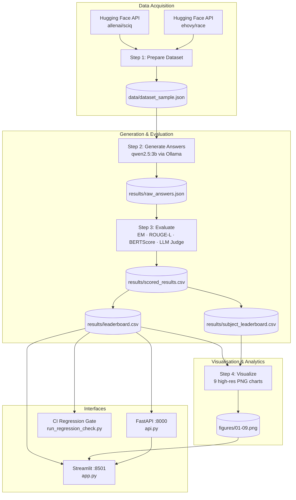

<div align="center">

# 🎓 EduBench-Local

**A production-grade, end-to-end benchmarking pipeline for evaluating local LLMs on educational QA tasks.**

[](https://python.org)
[](https://ollama.com)
[](https://fastapi.tiangolo.com)
[](https://streamlit.io)
[](LICENSE)

> **No cloud. No API costs. No data leaving your machine.**  
> Run, evaluate and visualise LLM performance entirely on local infrastructure.

[Features](#-features) · [Architecture](#-architecture) · [Quick Start](#-quick-start) · [Pipeline Steps](#-pipeline-steps) · [Results](#-baseline-results) · [Dashboard](#-dashboard--api) · [Roadmap](#-roadmap)

</div>

---

## ✨ Features

| | |
|---|---|
| 🔒 **Fully Local** | Powered by [Ollama](https://ollama.com) — zero cloud calls, zero data leakage |
| ♻️ **Resumable Pipeline** | Every step is crash-safe; re-run from where it left off |
| 🧑‍⚖️ **LLM-as-Judge** | `mistral:7b` scores answers on Correctness, Completeness & Clarity |
| 📏 **4 Metrics** | Exact Match · ROUGE-L · BERTScore F1 · LLM Judge (1–5) |
| 📊 **9 Charts** | Publication-quality dark-mode figures via matplotlib + seaborn |
| ⚡ **REST API** | FastAPI backend with `/health`, `/leaderboard`, `/generate` endpoints |
| 🖥️ **Web Dashboard** | Interactive Streamlit UI with live model playground |
| 🔁 **CI Gate** | Automated regression checker with SLA threshold enforcement |

---

## 🏗️ Architecture



---

## 🚀 Quick Start

### Prerequisites

| Tool | Version | Install |
|------|---------|---------|
| Python | 3.10+ | [python.org](https://python.org) |
| Ollama | latest | [ollama.com](https://ollama.com) |
| Git | any | [git-scm.com](https://git-scm.com) |

### 1 — Clone & install

```bash
git clone https://github.com/itsankan16/Edulab.git
cd Edulab

python -m venv edubench-env
# Windows
edubench-env\Scripts\activate
# macOS / Linux
source edubench-env/bin/activate

pip install -r requirements.txt
```

### 2 — Pull the required Ollama models

```bash
ollama pull qwen2.5:3b     # student model (answer generation)
ollama pull mistral:7b     # judge model   (answer evaluation)
```

### 3 — Run the full pipeline

```bash
python step1_prepare_dataset.py   # fetch & sample dataset
python step2_generate_answers.py  # generate model answers
python step3_evaluate.py          # score with 4 metrics
python step4_visualize.py         # render 9 charts → figures/
```

### 4 — Launch the dashboard

```bash
# Windows one-click launcher
run_dashboard.bat

# Or manually (two terminals)
edubench-env\Scripts\uvicorn api:app --reload --port 8000
edubench-env\Scripts\streamlit run app.py --server.port 8501
```

Open **http://localhost:8501** in your browser.

---

## 📋 Pipeline Steps

### `step1_prepare_dataset.py`
- Fetches data from **allenai/sciq** (science QA) and **ehovy/race** (reading comprehension) via Hugging Face Datasets REST API — no `pyarrow` required.
- Samples `150` records per subject (configurable in `config.py`).
- Outputs → `data/dataset_sample.json`

### `step2_generate_answers.py`
- Submits each question to `qwen2.5:3b` via local Ollama.
- **Resumable** — skips already-answered `(model, id)` pairs on re-run.
- Records latency, prompt tokens, completion tokens per answer.
- Outputs → `results/raw_answers.json`

### `step3_evaluate.py`
- Scores every answer with four metrics:

| Metric | Description | Range |
|--------|-------------|-------|
| **Exact Match** | Normalised string equality | 0 / 1 |
| **ROUGE-L** | Longest common subsequence F1 | 0 – 1 |
| **BERTScore F1** | Contextual embedding similarity | 0 – 1 |
| **LLM Judge** | `mistral:7b` rates on 0–10, normalised to 1–5 | 1 – 5 |

- **Resumable** — appends new rows, never re-scores completed pairs.
- Outputs → `results/scored_results.csv`, `results/leaderboard.csv`, `results/subject_leaderboard.csv`

### `step4_visualize.py`
- Reads `leaderboard.csv` + `subject_leaderboard.csv` directly (no re-derivation).
- Generates **9 high-resolution PNG charts** at 200 DPI into `figures/`.

| # | Figure | Description |
|---|--------|-------------|
| 01 | Overall score bars | EM% · ROUGE-L · BERT-F1 · LLM(1-5) grouped per model |
| 02 | Latency vs accuracy | Bubble scatter sized by N questions |
| 03 | Subject heatmap | Model × Subject LLM score matrix |
| 04 | Subject bar comparison | Per-subject LLM score grouped bars |
| 05 | Exact match rate | Horizontal EM% bar per model |
| 06 | Multi-metric heatmap | ROUGE-L / BERT-F1 / LLM side-by-side |
| 07 | Score distribution | Violin + strip plot of LLM score spread |
| 08 | Latency distribution | Box plot of per-model response times |
| 09 | Tokens vs latency | Scatter: token count vs response latency |

---

## 📈 Baseline Results

Evaluated on **877 questions** across **5 subjects** with `qwen2.5:3b`:

| Subject | EM% | ROUGE-L | BERT-F1 | LLM (1–5) | N |
|---------|-----|---------|---------|-----------|---|
| science | **10.0%** | 0.227 | 0.859 | **4.79** | 150 |
| reading_comprehension_squad | 2.0% | 0.295 | 0.873 | 4.54 | 150 |
| science_challenge | 0.0% | 0.106 | 0.857 | 4.06 | 150 |
| reading_comprehension | 2.7% | 0.000 | 0.881 | 3.75 | 150 |
| general_science | 0.0% | 0.057 | 0.842 | 3.43 | 150 |
| **Overall** | **2.9%** | **0.137** | **0.863** | **4.11** | **750** |

> High BERT-F1 with low Exact Match indicates the model produces semantically correct answers but doesn't mirror reference wording exactly — typical generative behaviour.

---

## 🖥️ Dashboard & API

### Streamlit Dashboard (`http://localhost:8501`)

| Page | Description |
|------|-------------|
| 📊 **Leaderboard & Analytics** | Metric spotlight cards, full leaderboard table, per-subject breakdown, dynamic filtering |
| 🖼️ **Visualizations** | Gallery of all 9 generated charts |
| 🧪 **Live Playground** | Real-time prompt testing against any local Ollama model |

### FastAPI Backend (`http://localhost:8000`)

| Method | Endpoint | Description |
|--------|----------|-------------|
| `GET` | `/health` | Liveness probe — API + Ollama status + model inventory |
| `GET` | `/leaderboard` | Overall + per-subject leaderboard as JSON |
| `POST` | `/generate` | Live Ollama inference with latency & token metrics |

Interactive API docs → **http://localhost:8000/docs**

---

## 📁 Project Structure

```
Edulab/
├── config.py                    # Central configuration (paths, models, prompts)
├── step1_prepare_dataset.py     # Dataset fetch & sampling
├── step2_generate_answers.py    # LLM answer generation (resumable)
├── step3_evaluate.py            # 4-metric evaluation + LLM judge
├── step4_visualize.py           # 9-chart visualization engine
├── api.py                       # FastAPI REST backend
├── app.py                       # Streamlit web dashboard
├── run_regression_check.py      # CI quality gate
├── run_dashboard.bat            # Windows one-click launcher
├── requirements.txt
├── data/
│   └── dataset_sample.json      # Sampled benchmark questions
└── results/
    ├── leaderboard.csv           # Per-model aggregated scores
    └── subject_leaderboard.csv  # Per-model × per-subject scores
```

> `figures/`, `results/scored_results.csv`, `results/raw_answers.json`, and `edubench-env/` are generated at runtime and excluded from version control via `.gitignore`.

---

## ⚙️ Configuration

All settings live in [`config.py`](config.py):

```python
SAMPLE_SIZE_PER_SUBJECT = 150   # questions per subject
RANDOM_SEED             = 42    # reproducible sampling
MODELS                  = ["qwen2.5:3b"]   # student models to benchmark
JUDGE_MODEL             = "mistral:7b"     # LLM evaluator
```

---

## 🔁 CI Regression Gate

```bash
python run_regression_check.py
```

Runs **5 verification modules** (13 total checks):
1. Artifact existence & non-empty check
2. JSON schema integrity (`raw_answers.json`)
3. CSV schema integrity (`leaderboard.csv`)
4. Primary model presence in results
5. SLA threshold enforcement (min LLM score ≥ 3.0, latency ≤ 10s, errors ≤ 10)

Returns exit code `0` (PASS) or `1` (FAIL) — compatible with GitHub Actions.

---

## 🛣️ Roadmap

- [ ] Multi-model leaderboards (`llama3.2:3b`, `gemma2:2b`, `phi3:mini`)
- [ ] Additional datasets (GSM8k for maths, HumanEval for code)
- [ ] Scheduled benchmark runs via cron for regression detection over time
- [ ] Export leaderboard as shareable HTML report
- [ ] Docker Compose deployment (Ollama + API + Dashboard)

---

## 📦 Dependencies

```
ollama          # Local LLM inference
fastapi         # REST API backend
uvicorn         # ASGI server
streamlit       # Web dashboard
rouge-score     # ROUGE-L metric
bert-score      # BERTScore metric
matplotlib      # Chart generation
seaborn         # Statistical visualizations
pandas          # Data manipulation
numpy           # Numerical operations
tqdm            # Progress bars
httpx           # Async HTTP client
```

---

## 📄 License

This project is licensed under the **MIT License** — see [LICENSE](LICENSE) for details.

---

<div align="center">

Built with ❤️ · Runs entirely offline · No API keys required

</div>
