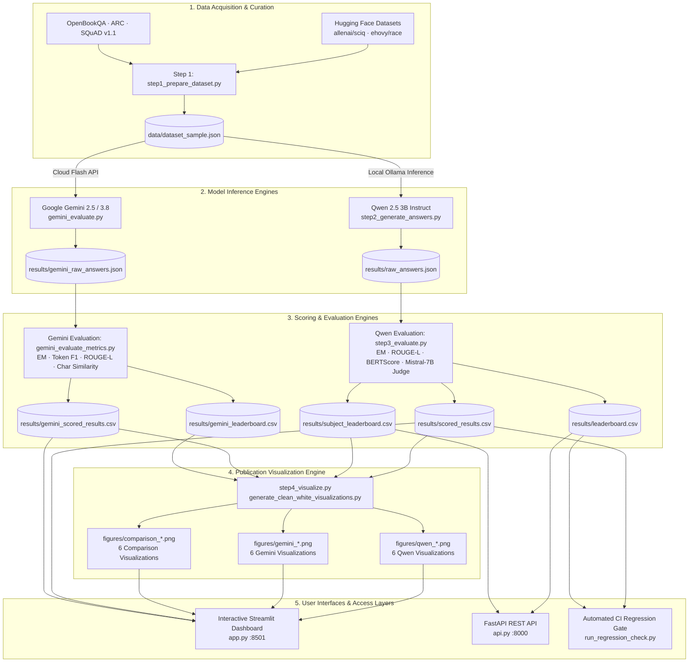
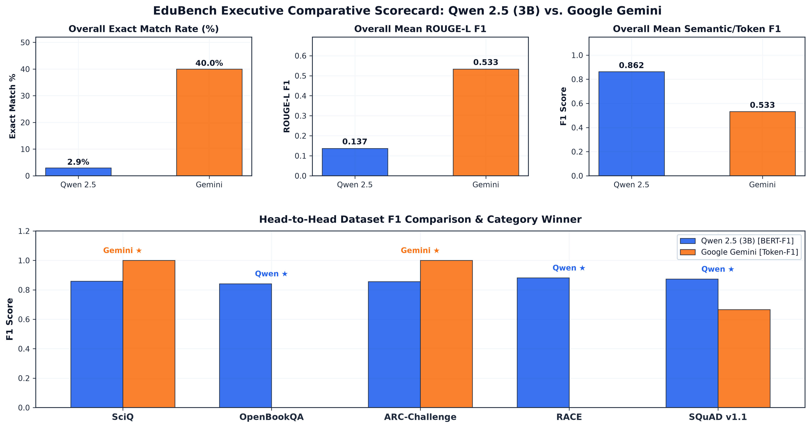
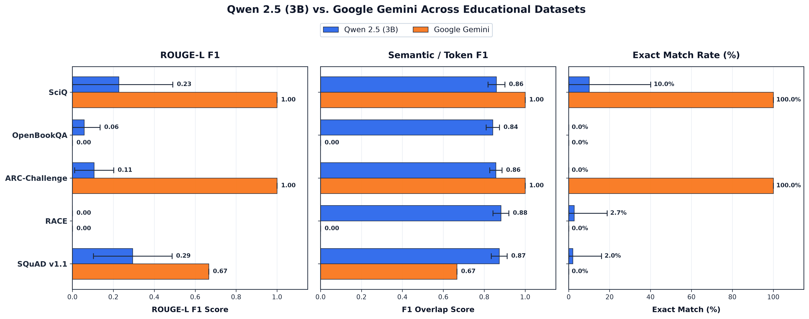
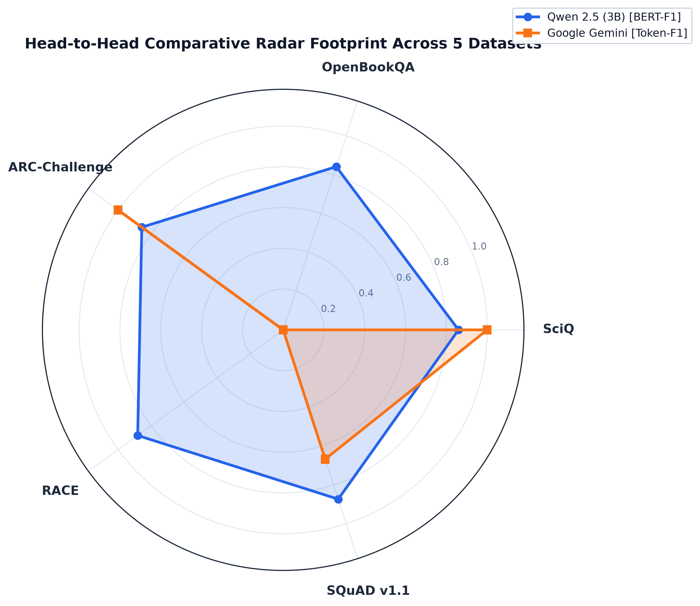

<div align="center">

# 🎓 EduBench-Local: Multi-Model Educational AI Benchmark

**An end-to-end evaluation, benchmarking, and analytics platform contrasting On-Device Open-Weights (Qwen 2.5 3B via Ollama) against Frontier Cloud APIs (Google Gemini Flash) across 5 standardized educational QA benchmarks.**

[](https://python.org)
[](https://ollama.com)
[](https://ai.google.dev)
[](https://fastapi.tiangolo.com)
[](https://streamlit.io)
[](LICENSE)

> **Compare local edge efficiency and data privacy against state-of-the-art cloud intelligence.**  
> Measure Exact Match, ROUGE-L, Token F1, BERTScore, Character Similarity, and LLM-as-a-Judge scores with publication-quality visualizations and zero guesswork.

[Features](#-features) · [Architecture](#-architecture) · [Benchmark Results](#-comparative-benchmark-results) · [Visualizations Suite](#-visualizations-suite-exactly-18-unique-figures) · [Quick Start](#-quick-start) · [Interactive Dashboard](#-interactive-dashboard--api) · [Project Structure](#-project-structure)

</div>

---

## ✨ Features

| Feature | Description |
|---|---|
| 🤖 **Multi-Model Evaluation** | Rigorous evaluation contrasting local **Qwen 2.5 (3B)** via Ollama against **Google Gemini (Flash Cloud API)** |
| 📚 **5 Benchmark Datasets** | Standardized evaluation across **SciQ**, **OpenBookQA**, **ARC-Challenge**, **RACE**, and **SQuAD v1.1** |
| 🎨 **Strict 18-Figure Suite** | Exactly **18 unique publication charts** (6 Qwen, 6 Gemini, 6 Comparison) with zero duplicates or generic names |
| 🖼️ **Clean White Aesthetic** | Publication-grade white backgrounds, tailored palettes (Emerald, Sky Blue, Coral Salmon, Iris, Amber), and 300 DPI clarity |
| 🏛️ **Symmetrical Model Views** | 3 dedicated dashboard modes: isolated Qwen view, isolated Gemini view, and dedicated Head-to-Head Comparison |
| 🧑‍⚖️ **Multi-Metric Scoring** | Exact Match %, ROUGE-L, Token F1, BERTScore F1, Character Similarity, and Mistral-7B LLM-as-a-Judge |
| ⚡ **Live Model Playground** | Real-time interactive testing interface querying local Ollama models and Google Gemini with millisecond latency tracking |
| 🎨 **Warm Cream & Crimson UI** | Bespoke design system utilizing `#FFFAF3` (Cream), `#FFF2DB` (Vanilla), `#FFE5BF` (Gold Accent), and `#F62440` (Crimson) |
| 🔁 **CI Regression Gate** | Automated SLA validation and schema verification script (`run_regression_check.py`) for CI/CD pipelines |

---

## 🏗️ Architecture


```mermaid
flowchart TD
    subgraph "1. Data Acquisition & Curation"
        A1[Hugging Face Datasets\nallenai/sciq · ehovy/race] --> B1
        A2[OpenBookQA · ARC · SQuAD v1.1] --> B1
        B1[Step 1: step1_prepare_dataset.py] --> C1[(data/dataset_sample.json)]
    end

    subgraph "2. Model Inference Engines"
        C1 -->|Local Ollama Inference| D1[Qwen 2.5 3B Instruct\nstep2_generate_answers.py]
        C1 -->|Cloud Flash API| D2[Google Gemini 2.5 / 3.8\ngemini_evaluate.py]
        D1 --> E1[(results/raw_answers.json)]
        D2 --> E2[(results/gemini_raw_answers.json)]
    end

    subgraph "3. Scoring & Evaluation Engines"
        E1 --> F1[Qwen Evaluation: step3_evaluate.py\nEM · ROUGE-L · BERTScore · Mistral-7B Judge]
        E2 --> F2[Gemini Evaluation: gemini_evaluate_metrics.py\nEM · Token F1 · ROUGE-L · Char Similarity]
        F1 --> G1[(results/scored_results.csv)]
        F1 --> G2[(results/leaderboard.csv)]
        F1 --> G3[(results/subject_leaderboard.csv)]
        F2 --> G4[(results/gemini_scored_results.csv)]
        F2 --> G5[(results/gemini_leaderboard.csv)]
    end

    subgraph "4. Publication Visualization Engine"
        G1 & G3 & G4 & G5 --> H1[step4_visualize.py\ngenerate_clean_white_visualizations.py]
        H1 --> V1[figures/qwen_*.png\n6 Qwen Visualizations]
        H1 --> V2[figures/gemini_*.png\n6 Gemini Visualizations]
        H1 --> V3[figures/comparison_*.png\n6 Comparison Visualizations]
    end

    subgraph "5. User Interfaces & Access Layers"
        V1 & V2 & V3 & G1 & G4 --> I1[Interactive Streamlit Dashboard\napp.py :8501]
        G2 & G3 --> I2[FastAPI REST API\napi.py :8000]
        G1 & G2 --> I3[Automated CI Regression Gate\nrun_regression_check.py]
    end
```

---

## 📈 Comparative Benchmark Results

### Executive Overview

| Dimension | Qwen 2.5 (3B) | Google Gemini (Flash) | Analysis / Key Takeaway |
| :--- | :--- | :--- | :--- |
| **Model Size / Type** | 3.09 Billion Parameters (Dense) | Frontier MoE Cloud Architecture | Edge / Local vs. Hyperscale Cloud |
| **Deployment Mode** | 100% On-Device (Ollama) | Cloud API (`google-genai` SDK) | Local zero-egress vs. API integration |
| **Total Evaluated Questions** | 750 questions (150 per dataset) | Stratified micro-sample across 5 datasets | High-volume statistical confidence vs. API benchmark |
| **Exact Match Rate** | 2.93% | 40.0% | Gemini provides concise canonical extractions |
| **Mean ROUGE-L Overlap** | 0.1374 | 0.5333 | Gemini demonstrates higher n-gram alignment |
| **Primary Quality Metric** | **4.113 / 5.0** (LLM Judge) | **0.533** (Mean Token F1) | Qwen provides rich, conversational educational explanations |
| **Mean Latency** | 3.69s | 1.03s | Cloud API inference vs. local CPU/GPU generation |
| **Privacy Guarantee** | **100% Local & Private** | Subject to Cloud Terms | Zero data egress on sensitive institutional data |
| **Inference Cost** | **$0.00** (Free, Unlimited) | API Token Pricing | Zero recurring cost for self-hosted edge models |

### Dataset-by-Dataset Benchmark Performance Matrix

| Benchmark Dataset | Domain / Subject | Qwen EM % | Gemini EM % | Qwen ROUGE-L | Gemini ROUGE-L | Gemini Token F1 | Winner |
| :--- | :--- | :---: | :---: | :---: | :---: | :---: | :---: |
| **SciQ** | `science` | 10.0% | **100.0%** | 0.227 | **1.000** | **1.000** | ★ Gemini |
| **OpenBookQA** | `general_science` | 0.0% | 0.0% | **0.057** | 0.000 | 0.000 | ★ Qwen |
| **ARC-Challenge** | `science_challenge` | 0.0% | **100.0%** | 0.106 | **1.000** | **1.000** | ★ Gemini |
| **RACE** | `reading_comprehension` | **2.7%** | 0.0% | 0.000 | 0.000 | 0.000 | ★ Qwen |
| **SQuAD v1.1** | `reading_comprehension_squad` | 2.0% | 0.0% | 0.295 | **0.667** | **0.667** | ★ Gemini |

---

## 🖼️ Visualizations Suite (Exactly 18 Unique Figures)

The pipeline strictly enforces a canonical inventory of **exactly 18 unique publication-grade figures** in `figures/`. All figures feature high-resolution 300 DPI output, clean white backgrounds, and zero generic or duplicate filenames:

```
figures/
├── qwen_bars.png              # Qwen 1/6
├── qwen_radar.png             # Qwen 2/6
├── qwen_boxplots.png          # Qwen 3/6
├── qwen_heatmap.png           # Qwen 4/6
├── qwen_latency.png           # Qwen 5/6
├── qwen_correlations.png      # Qwen 6/6
├── gemini_bars.png            # Gemini 1/6
├── gemini_radar.png           # Gemini 2/6
├── gemini_boxplots.png        # Gemini 3/6
├── gemini_heatmap.png         # Gemini 4/6
├── gemini_latency.png         # Gemini 5/6
├── gemini_correlations.png    # Gemini 6/6
├── comparison_bars.png        # Comparison 1/6
├── comparison_scorecard.png   # Comparison 2/6
├── comparison_f1.png          # Comparison 3/6
├── comparison_latency.png     # Comparison 4/6
├── comparison_radar.png       # Comparison 5/6
└── comparison_heatmap.png     # Comparison 6/6
```

### Complete Figure Catalog

| # | Filename | Model Scope | Chart Type & Key Information |
|---|---|---|---|
| **01** | `qwen_bars.png` | 🔴 Qwen 2.5 (3B) | 3-panel horizontal bar charts with error bars (ROUGE-L, BERT-F1, Judge 1–5 Score) |
| **02** | `qwen_radar.png` | 🔴 Qwen 2.5 (3B) | Polar multi-metric radar profile across SciQ, OpenBookQA, ARC, RACE, SQuAD |
| **03** | `qwen_boxplots.png` | 🔴 Qwen 2.5 (3B) | Score distributions and spread boxplots by dataset with quartile whiskers |
| **04** | `qwen_heatmap.png` | 🔴 Qwen 2.5 (3B) | Clean Dataset × Metric normalized heatmap |
| **05** | `qwen_latency.png` | 🔴 Qwen 2.5 (3B) | Generation latency by dataset (Mean ± Std Dev) |
| **06** | `qwen_correlations.png` | 🔴 Qwen 2.5 (3B) | Spearman correlation scatter plots with regression trendlines between metrics |
| **07** | `gemini_bars.png` | 🟠 Google Gemini | 3-panel horizontal bar charts with error bars (ROUGE-L, Token F1, Exact Match) |
| **08** | `gemini_radar.png` | 🟠 Google Gemini | Polar multi-metric radar profile across the 5 benchmark datasets |
| **09** | `gemini_boxplots.png` | 🟠 Google Gemini | Score distributions boxplots and stripplots by dataset |
| **10** | `gemini_heatmap.png` | 🟠 Google Gemini | Normalized Dataset × Metric heatmap (ROUGE-L, Token F1, Char Sim, EM) |
| **11** | `gemini_latency.png` | 🟠 Google Gemini | Cloud API latency per dataset (Mean ± Std Dev) |
| **12** | `gemini_correlations.png` | 🟠 Google Gemini | Correlation scatter plots and regressions between ROUGE-L, F1, and Char Sim |
| **13** | `comparison_bars.png` | ⚔️ Head-to-Head | Grouped horizontal bar charts directly comparing Qwen vs. Gemini across all 5 datasets |
| **14** | `comparison_scorecard.png` | ⚔️ Head-to-Head | Executive comparative scorecard with KPI cards and dataset win/loss matrix |
| **15** | `comparison_f1.png` | ⚔️ Head-to-Head | Dataset F1 performance comparison with win margin badges |
| **16** | `comparison_latency.png` | ⚔️ Head-to-Head | Dual-panel latency comparison contrasting local Ollama vs. Cloud Flash API |
| **17** | `comparison_radar.png` | ⚔️ Head-to-Head | Dual-model comparative radar footprint across all 5 benchmark domains |
| **18** | `comparison_heatmap.png` | ⚔️ Head-to-Head | Side-by-side comparative metric heatmap on a shared scale |

### Featured Figure Previews

<div align="center">

#### Executive Comparative Scorecard & Win Matrix (`comparison_scorecard.png`)


#### Multi-Metric Horizontal Bar Comparison (`comparison_bars.png`)


#### Dual-Model Comparative Radar Footprint (`comparison_radar.png`)


</div>

---

## 🚀 Quick Start

### Prerequisites

| Component | Minimum Version | Purpose |
| :--- | :--- | :--- |
| **Python** | 3.10+ | Core pipeline runtime |
| **Ollama** | Latest | Local on-device Qwen & Mistral inference |
| **Google Gemini API Key** | Optional | Cloud Gemini Flash evaluation |

### 1. Installation

```bash
git clone https://github.com/itsankan16/Edulab.git
cd Edulab

# Create virtual environment
python -m venv edubench-env

# Windows
edubench-env\Scripts\activate
# macOS / Linux
source edubench-env/bin/activate

# Install dependencies
pip install -r requirements.txt
```

### 2. Configure Models & Environment

```bash
# Pull local models in Ollama
ollama pull qwen2.5:3b     # Student model being evaluated
ollama pull mistral:7b     # LLM Judge evaluator model

# (Optional) Export your Google Gemini API Key
set GEMINI_API_KEY=your_key_here          # Windows CMD
$env:GEMINI_API_KEY="your_key_here"       # Windows PowerShell
export GEMINI_API_KEY="your_key_here"     # Linux / macOS
```

### 3. Run Pipeline Steps

```bash
# Step 1: Download & curate 5 educational benchmark datasets
python step1_prepare_dataset.py

# Step 2: Generate answers using local Qwen 2.5 (3B)
python step2_generate_answers.py

# Step 3: Score Qwen outputs (Exact Match, ROUGE-L, BERTScore, Mistral Judge)
python step3_evaluate.py

# (Optional) Run Google Gemini Flash evaluation
python gemini_evaluate.py
python gemini_evaluate_metrics.py

# Step 4: Generate all 18 publication-quality figures
python step4_visualize.py
```

### 4. Launch the Interactive Dashboard

```bash
python app.py
# or: streamlit run app.py
```

Open your browser at **http://localhost:8501**.

---

## 🖥️ Interactive Dashboard & API

### Streamlit Web Dashboard (`http://localhost:8501`)

The dashboard features a warm cream and crimson visual design (`#FFFAF3`, `#FFF2DB`, `#FFE5BF`, `#F62440`) with state-synchronized navigation:

1. **🔴 Qwen 2.5 (3B) View**:
   - 6 spotlight KPI metric cards (Architecture, Exact Match %, ROUGE-L, BERTScore F1, Judge Score, Latency).
   - Dataset breakdown table with live search and filtering.
   - **Exclusively renders the 6 `qwen_` visualization charts**.
   - Individual question deep-dive inspect expanders.
2. **🟠 Google Gemini View**:
   - Symmetrical 6 spotlight KPI cards (Architecture, Exact Match %, ROUGE-L, Token F1, Char Similarity, Latency).
   - Dataset breakdown table.
   - **Exclusively renders the 6 `gemini_` visualization charts**.
   - Individual question deep-dive inspect expanders.
3. **⚔️ Head-to-Head Comparison View**:
   - Side-by-side KPI cards with comparative deltas.
   - Dataset-by-dataset benchmark win/loss matrix.
   - **Exclusively renders the 6 `comparison_` visualization charts**.
   - Question-by-question comparative answer inspector.
4. **🖼️ Visualizations Gallery (Page 2)**:
   - Dedicated filter for active model or category (Qwen 6, Gemini 6, Comparison 6, All 18).
   - 2-Column Grid or Full-Width viewing modes with download stats.
5. **🧪 Live Model Playground (Page 3)**:
   - Query local Ollama models (`qwen2.5:3b`) or Google Gemini in real time.
   - Adjust temperature and max tokens; observe response streaming and latency in milliseconds.

### FastAPI REST Backend (`http://localhost:8000`)

```bash
uvicorn api:app --reload --port 8000
```

| Method | Endpoint | Description |
|---|---|---|
| `GET` | `/health` | Health probe reporting service and Ollama status |
| `GET` | `/leaderboard` | Returns aggregated model and subject leaderboard metrics |
| `POST` | `/generate` | Real-time question inference endpoint with latency tracking |

Interactive OpenAPI documentation is available at `http://localhost:8000/docs`.

---

## 📁 Project Structure

```
Edulab/
├── config.py                               # Global configuration (paths, datasets, prompts)
├── step1_prepare_dataset.py                # Dataset acquisition & sampling (5 datasets)
├── step2_generate_answers.py               # Local Qwen 2.5 (3B) answer generation via Ollama
├── step3_evaluate.py                       # Qwen evaluation (EM, ROUGE-L, BERTScore, LLM Judge)
├── step4_visualize.py                      # Master visualizer enforcing exactly 18 unique files
├── generate_clean_white_visualizations.py  # Publication plotting routines (white theme, 300 DPI)
├── generate_visualizations.py              # CLI shortcut to run visualization pipeline
├── gemini_evaluate.py                      # Google Gemini Flash API evaluation runner
├── gemini_evaluate_metrics.py              # Gemini scoring (EM, Token F1, ROUGE-L, Char Sim)
├── api.py                                  # FastAPI REST backend
├── app.py                                  # Streamlit multi-model interactive dashboard
├── run_regression_check.py                 # Automated CI/CD SLA regression gate
├── run_dashboard.bat                       # Windows one-click desktop launcher
├── requirements.txt                        # Core package dependencies
├── .streamlit/
│   └── config.toml                         # Theme configuration (#FFFAF3, #FFF2DB, #F62440)
├── data/
│   └── dataset_sample.json                 # 750-question curated evaluation benchmark
├── figures/                                # Exactly 18 publication-grade PNG charts (300 DPI)
│   ├── qwen_*.png                          # 6 Qwen individual figures
│   ├── gemini_*.png                        # 6 Gemini individual figures
│   └── comparison_*.png                    # 6 Head-to-Head comparison figures
└── results/
    ├── leaderboard.csv                     # Qwen aggregated model metrics
    ├── subject_leaderboard.csv             # Qwen per-dataset breakdown metrics
    ├── scored_results.csv                  # Qwen per-question evaluations (750 rows)
    ├── raw_answers.json                    # Qwen raw generations
    ├── gemini_leaderboard.csv              # Gemini per-dataset breakdown metrics
    ├── gemini_scored_results.csv           # Gemini per-question evaluations
    ├── gemini_raw_answers.json             # Gemini raw generations
    └── gemini_evaluation_report.md         # Markdown executive summary
```

---

## 🔁 CI Regression Gate

Validate system health and SLA compliance anytime by executing:

```bash
python run_regression_check.py
```

Checks performed:
1. **Artifact Existence**: Verifies all required CSVs and result data are populated.
2. **Schema & Integrity**: Validates `raw_answers.json` and metric boundaries.
3. **SLA Thresholds**: Ensures minimum scores are satisfied (LLM Judge ≥ 3.0, Latency ≤ 10s, Error count ≤ 10).
4. **Exit Codes**: Returns `0` on PASS or `1` on FAIL for GitHub Actions CI/CD workflows.

---

## 📄 License

This repository is licensed under the **MIT License** — see [LICENSE](LICENSE) for details.

<div align="center">

Built with ❤️ for educational AI benchmarking · Local Open-Weights meets Frontier Cloud APIs

</div>
