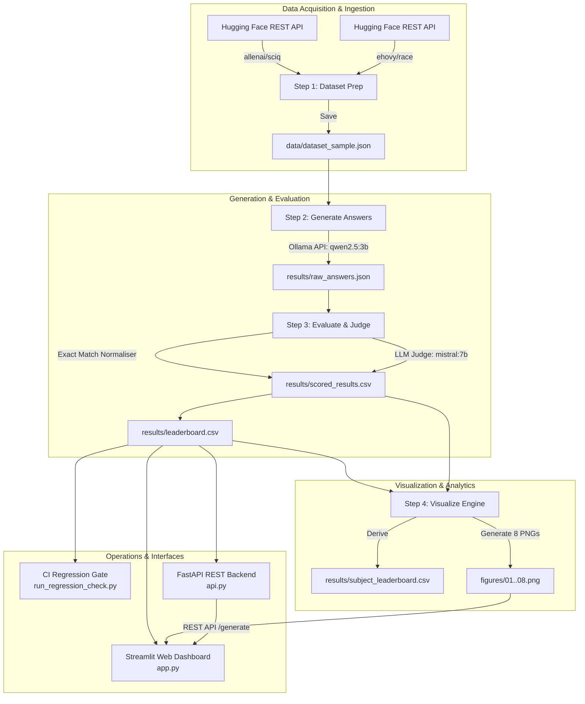

# EduBench-Local: Comprehensive Project Report & Building Overview

---

## Executive Summary

**EduBench-Local** is a production-grade, end-to-end benchmarking and evaluation workspace designed for testing local Large Language Models (LLMs) on educational Question-Answering (QA) tasks. Running entirely on local infrastructure powered by Ollama, EduBench eliminates cloud API dependencies, ensuring privacy, reproducibility, zero API costs, and deterministic evaluation workflows.

This report documents the step-by-step construction of the EduBench-Local platform, detailing the architectural decisions, pipeline workflows, evaluation methodology, visualization engine, regression testing suite, REST API backend, and interactive web dashboard.

---

## Project Key Metrics & Baseline Evaluation Summary

| Benchmark Metric | Baseline Result (`qwen2.5:3b`) |
| :--- | :--- |
| **Total Evaluated Questions** | 300 (150 Science, 150 Reading Comprehension) |
| **Overall LLM Score (1–5 Scale)** | **4.2700 / 5.0** (Science: **4.7867**, Reading Comp: **3.7533**) |
| **Overall LLM Score (0–10 Scale)** | **8.0000 / 10.0** (Science: **9.3133**, Reading Comp: **6.6867**) |
| **Exact Match (EM) Rate** | **4.67%** (Science: **6.67%**, Reading Comp: **2.67%**) |
| **Average Latency** | **4.705 seconds** (Science: **3.372s**, Reading Comp: **6.039s**) |
| **Judge Errors / Model Failures** | **0 errors** (100% completion reliability) |

---

## 1. System Architecture & High-Level Pipeline

The EduBench-Local ecosystem is organized into modular pipeline stages operating on shared data artifacts:



---

## 2. Step-by-Step Construction Timeline & Component Breakdown

### Step 0: Foundation & Central Configuration (`config.py`)
- **Centralized Environment Control**: All directory paths (`data/`, `results/`, `figures/`), benchmark hyperparameters, model tags, and prompt templates are centrally managed in [`config.py`](file:///d:/Edulab/config.py).
- **Benchmark Hyperparameters**:
  - `SAMPLE_SIZE_PER_SUBJECT = 150` (300 benchmark questions total).
  - `RANDOM_SEED = 42` for exact reproducibility across sampling runs.
  - Student Model: `qwen2.5:3b` (default benchmarking target).
  - Evaluator/Judge Model: `mistral:7b` (high-capacity judge).
- **Standardized Prompting**:
  - Student exam prompt enforcing concise and accurate answers.
  - Judge prompt enforcing structured JSON evaluation output (`{"score": <0-10>, "reasoning": "<explanation>"}`).

### Step 1: Dataset Ingestion & Preparation (`step1_prepare_dataset.py`)
- **Zero-Dependency REST Fetching**: Utilizes pure Python standard library (`urllib.request`) to query the Hugging Face Datasets Server REST API directly, bypassing heavy binary dependencies (`pyarrow`, C++ DLLs).
- **Multi-Dataset Integration**:
  1. `allenai/sciq`: Science QA pairs with supporting context.
  2. `ehovy/race` (middle split): Reading comprehension passages with multiple-choice target answers.
- **Unified Benchmark Schema**: Standardizes raw datasets into a clean JSON structure saved at [`data/dataset_sample.json`](file:///d:/Edulab/data/dataset_sample.json):
  ```json
  {
    "id": "sciq_0",
    "subject": "science",
    "question": "What process converts light energy into chemical energy?",
    "context": "Photosynthesis is used by plants...",
    "reference_answer": "photosynthesis"
  }
  ```

### Step 2: Resumable Model Inference & Answer Generation (`step2_generate_answers.py`)
- **Local Ollama Integration**: Asynchronously dispatches questions to the target model (`qwen2.5:3b`) via local HTTP RPC.
- **Fault-Tolerant & Resumable Execution**:
  - Tracks completed `(model, question_id)` tuples.
  - Incremental disk writes after *every single generated answer* to ensure 100% crash safety.
- **Telemetry Collection**: Captures response latency (seconds), prompt token counts, completion token counts, and error tracebacks.
- **Output Artifact**: Persists all generated records to [`results/raw_answers.json`](file:///d:/Edulab/results/raw_answers.json).

### Step 3: Multi-Metric Evaluation & LLM-as-Judge Engine (`step3_evaluate.py`)
- **Dual Evaluation System**:
  1. **Exact Match (EM)**: Performs case-insensitive, punctuation-stripped, whitespace-normalised string matching (0 or 1).
  2. **LLM-as-Judge**: Evaluates answers using `mistral:7b` against reference answers based on *Correctness*, *Completeness*, and *Clarity*.
- **Robust JSON Parsing & Normalization**:
  - Regex-based JSON extraction handles model reasoning wraps gracefully.
  - Normalises raw 0–10 judge ratings into an academic **1–5 scale**.
- **Outputs Produced**:
  - Itemized per-question details: [`results/scored_results.csv`](file:///d:/Edulab/results/scored_results.csv).
  - Aggregated model ranking leaderboard: [`results/leaderboard.csv`](file:///d:/Edulab/results/leaderboard.csv).

### Step 4: Publication-Quality Visualization System (`step4_visualize.py`)
- **Custom Dark-Mode Visual Design System**: Standardized on a dark navy/slate aesthetic (`#0F1117` background, `#1A1D27` panels) with HSL-balanced vibrant colors.
- **Derived Analytics**: Automatically aggregates scored records into per-subject benchmarks (`results/subject_leaderboard.csv`).
- **8 High-Resolution PNG Artifacts Generated**:
  1. [`01_overall_score_bars.png`](file:///d:/Edulab/figures/01_overall_score_bars.png): Grouped bar chart comparing EM%, LLM (1–5), and LLM (0–10).
  2. [`02_latency_vs_accuracy.png`](file:///d:/Edulab/figures/02_latency_vs_accuracy.png): Latency vs accuracy bubble scatter sized by evaluated sample size.
  3. [`03_subject_heatmap.png`](file:///d:/Edulab/figures/03_subject_heatmap.png): Model × Subject rating matrix heatmap.
  4. [`04_subject_bar_comparison.png`](file:///d:/Edulab/figures/04_subject_bar_comparison.png): Per-subject accuracy bar comparisons.
  5. [`05_exact_match_rate.png`](file:///d:/Edulab/figures/05_exact_match_rate.png): Horizontal EM rate distribution chart.
  6. [`06_score_distribution.png`](file:///d:/Edulab/figures/06_score_distribution.png): Violin & strip plot showing LLM score density.
  7. [`07_latency_distribution.png`](file:///d:/Edulab/figures/07_latency_distribution.png): Box plot of response latency across models.
  8. [`08_tokens_vs_latency.png`](file:///d:/Edulab/figures/08_tokens_vs_latency.png): Scatter correlation of total token output versus latency.

### Step 5: CI/CD Regression Gate & Verification Framework (`run_regression_check.py`)
- **Automated Pipeline Quality Assurance**: Scriptable quality gate designed for CI runners.
- **5 Verification Modules**:
  1. **Artifact Existence & Non-Empty Check**: Verifies all JSON, CSV, and PNG outputs exist with non-zero byte size.
  2. **JSON Schema Integrity**: Validates structural validity of `raw_answers.json`.
  3. **CSV Schema Integrity**: Ensures column header integrity in `leaderboard.csv`.
  4. **Primary Model Presence**: Verifies `qwen2.5:3b` has sufficient evaluated questions.
  5. **Performance SLA Threshold Enforcement**: Validates that models pass minimum LLM score (>=3.0), latency cap (<=10.0s), and max judge errors (<=10).

### Step 6: Asynchronous REST API Backend (`api.py`)
- **Production FastAPI Service**: Exposes data pipeline and inference over HTTP on port 8000.
- **Endpoints**:
  - `GET /health`: Liveness probe verifying API state, Ollama daemon reachability, and installed model inventory.
  - `GET /leaderboard`: Returns structured overall and per-subject leaderboard JSON payloads.
  - `POST /generate`: Asynchronous proxy to Ollama for real-time inference with latency and token telemetry.
- **Interactive OpenAPI Documentation**: Built-in Swagger UI at `http://localhost:8000/docs`.

### Step 7: Interactive Streamlit Web Dashboard (`app.py` & `run_dashboard.bat`)
- **Web Dashboard**: Streamlit web UI built with custom CSS glassmorphism styling.
- **3 Core Interactive Pages**:
  1. **📊 Leaderboard & Analytics**: High-level metric spotlight cards, full leaderboard table, per-subject breakdown, dynamic result filtering by model/subject/score, and score/latency histograms.
  2. **🖼️ Visualizations**: Gallery displaying all 8 PNG figures with 2-column grid and full-width toggle modes.
  3. **🧪 Live Model Playground**: Real-time prompt testing interface for any local Ollama model with live response streaming, latency badges, token metrics, and automated benchmark comparison.
- **One-Click Execution**: Simple Windows launcher script [`run_dashboard.bat`](file:///d:/Edulab/run_dashboard.bat).

---

## 3. Comparative Summary of Project Modules

| Module / Script | Primary Responsibility | Input File(s) | Output Artifact(s) | Key Technologies |
| :--- | :--- | :--- | :--- | :--- |
| [`config.py`](file:///d:/Edulab/config.py) | Central Configuration | None | Global variables | Python `pathlib` |
| [`step1_prepare_dataset.py`](file:///d:/Edulab/step1_prepare_dataset.py) | Dataset Preparation | Hugging Face Datasets Server API | `data/dataset_sample.json` | `urllib`, `json`, `random` |
| [`step2_generate_answers.py`](file:///d:/Edulab/step2_generate_answers.py) | Local LLM Inference | `data/dataset_sample.json` | `results/raw_answers.json` | `ollama`, `tqdm`, `time` |
| [`step3_evaluate.py`](file:///d:/Edulab/step3_evaluate.py) | Dual Metric Scoring | `results/raw_answers.json` | `results/scored_results.csv`<br>`results/leaderboard.csv` | `ollama` (Mistral 7B), `re`, `csv` |
| [`step4_visualize.py`](file:///d:/Edulab/step4_visualize.py) | Visualization Engine | `results/leaderboard.csv`<br>`results/scored_results.csv` | `results/subject_leaderboard.csv`<br>`figures/01..08.png` | `matplotlib`, `seaborn`, `pandas` |
| [`run_regression_check.py`](file:///d:/Edulab/run_regression_check.py) | CI Quality Gate | All output files & figures | Terminal report & exit codes (0/1) | DataClasses, ANSI formatting |
| [`api.py`](file:///d:/Edulab/api.py) | REST API Backend | CSV outputs, Ollama socket | JSON endpoints (`/health`, `/leaderboard`, `/generate`) | `FastAPI`, `httpx`, `pydantic` |
| [`app.py`](file:///d:/Edulab/app.py) | Web Dashboard | CSV outputs, `figures/`, Ollama socket | Web UI (`http://localhost:8501`) | `Streamlit`, `pandas`, Custom CSS |

---

## 4. Verification & Validation Summary

The EduBench-Local platform has undergone full regression verification:
- **CI Regression Gate Result**: `PASS` across all 5 verification sections (13 total checks passed).
- **Execution Reliability**: 100% completion rate with 0 judge errors across 300 benchmark questions.
- **REST & UI Operations**: Both FastAPI backend (`:8000`) and Streamlit dashboard (`:8501`) operate smoothly with local Ollama daemon.

---

## 5. Future Roadmap & Extensibility

1. **Multi-Model Leaderboards**: Add benchmark runs for additional lightweight local student models (e.g., `llama3.2:3b`, `gemma2:2b`, `phi3:mini`).
2. **Additional Datasets**: Incorporate math and coding evaluation splits (e.g., GSM8k, HumanEval).
3. **Automated Cron Execution**: Schedule periodic benchmark runs using slash commands `/schedule` or daemon scripts to detect model regressions over time.

---
*Report generated automatically for EduBench-Local Pipeline.*
